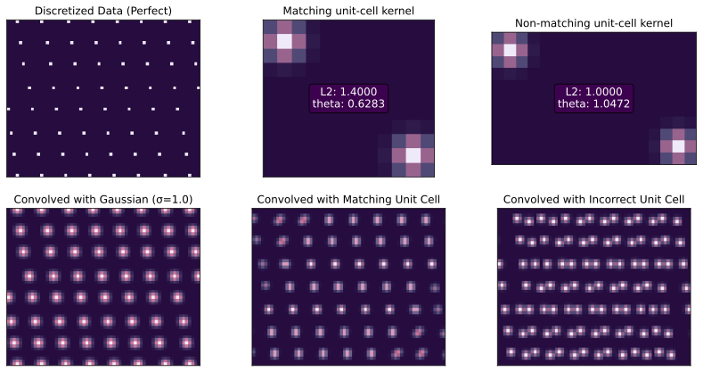

# NA599

## Install dependencies and sample data

```bash
conda install -f environment.yaml
conda activate na599p

wget -nc http://www.iro.umontreal.ca/\~lisa/icml2007data/mnist_rotation_new.zip -P data
unzip data/mnist_rotation_new.zip -d data/mnist_rotation_new
```

## Generate image data from signac trajectories

1. Copy the workspace you plan to convert into this folder
2. Run `python src/lattice.py` to generate the zipped numpy data files.
3. Run `python src/data.py` to verify that the dataset is constructed properly: you should see an image as expected

## Example Image:


